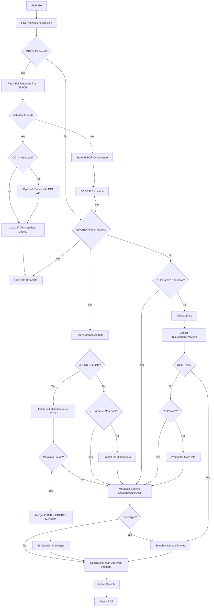

# Metadata Extraction Improvements Plan

## Overview

This plan refactors the metadata extraction workflow to improve reliability, reduce user effort, and ensure all information is collected once and is user-editable. The changes follow a simple, generalizable logic that fits the existing architecture.

## Current State Analysis

**Current Flow:**

1. GREP identifier extraction + API lookup (fast path)
2. GROBID extraction with retry logic (rotation, 4-page retry)
3. CrossRef/OpenAlex search only if GROBID found authors AND JSTOR ID exists
4. Ollama fallback (slow, 60-120 seconds)
5. Filter garbage authors (after all extraction)
6. Year/document type prompts
7. Manual entry if extraction fails

**Issues:**

- Retry logic unnecessary (Document Capture Pro provides correctly rotated PDFs)
- CrossRef/OpenAlex search too restrictive (only with JSTOR ID)
- Author filtering happens too late (after potential hallucinations)
- Ollama too slow for production use
- No online library search after manual entry
- No national library search for books

## Implementation Plan

### 1. Remove GROBID Retry Logic

**File**: `shared_tools/api/grobid_client.py`

**Changes**:

- Remove rotation retry logic (lines 225-244)
  - Keep rotation detection (lines 111-124) but skip retry attempts
  - Remove the `if not (handle_rotation and rotation_applied is None):` block
- Simplify retry logic to only try 4 pages if 2 pages fail (lines 210-223)
  - Keep this as a simple page count increase, not rotation-based

**Rationale**: Document Capture Pro provides correctly rotated documents. If PDFs have text on every page, rotation retries are unnecessary.

---

### 2. Filter Garbage Authors Immediately After Extraction

**File**: `scripts/paper_processor_daemon.py`

**Current Location**: Line 4058 (after all extraction methods)

**Changes**:

- Move `filter_garbage_authors()` call to immediately after GROBID extraction (around line 3885)
  - After GROBID succeeds and before CrossRef/OpenAlex search
- Add `filter_garbage_authors()` call immediately after Ollama extraction (around line 4038)
  - Only if Ollama is enabled and runs
- Keep existing call at line 4058 as fallback for other extraction methods

**Code Structure**:

```python
# After GROBID extraction (line ~3885)
if metadata and metadata.get('authors'):
    # Filter immediately to prevent hallucinations from affecting API search
    metadata = self.filter_garbage_authors(metadata, pdf_path=pdf_to_use)
    result['metadata'] = metadata
    # Continue with CrossRef/OpenAlex search...

# After Ollama extraction (line ~4038)
if ollama_result['success'] and ollama_result.get('metadata', {}).get('authors'):
    metadata = ollama_result['metadata']
    # Filter immediately after Ollama (can hallucinate)
    metadata = self.filter_garbage_authors(metadata, pdf_path=pdf_to_use)
    ollama_result['metadata'] = metadata
    result = ollama_result
```

**Rationale**: Both GROBID and Ollama can hallucinate authors. Filtering immediately prevents bad data from propagating to API searches.

---

### 3. JSTOR ID → Full Metadata Extraction

**File**: `scripts/paper_processor_daemon.py` and `shared_tools/metadata/paper_processor.py`

**Current State**:

- Fast path (Step 1): Currently implements JSTOR → DOI → API lookup (lines 559-595 in `paper_processor.py`)
- GROBID path (Step 2): Only searches by metadata, doesn't extract metadata from JSTOR page
- **NEW**: `JSTORClient.fetch_metadata_from_url()` now returns full structured metadata

**Changes**:

1. **Update fast path to use full JSTOR metadata** (in `paper_processor.py` around line 559-595)
   - When JSTOR ID found in GREP step, use `JSTORClient.fetch_metadata_from_url()` instead of `fetch_doi_from_url()`
   - This returns full metadata: title, authors, journal, year, volume, issue, pages, DOI, tags, document_type, etc.
   - Use JSTOR metadata directly (it's already complete and reliable)
   - Optionally: If DOI is present in JSTOR metadata, can still enrich with CrossRef/OpenAlex for additional fields
   - Set document type to 'journal_article' (JSTOR confirms this)

2. **Add JSTOR metadata extraction to GROBID path** (around line 3887-3930 in `paper_processor_daemon.py`)
   - After GROBID extraction, check if JSTOR ID exists
   - If JSTOR ID found: Fetch full metadata from JSTOR using `JSTORClient.fetch_metadata_from_url()`
   - Merge JSTOR metadata with GROBID metadata (prefer JSTOR data, supplement with GROBID)
   - If JSTOR metadata fetch fails: Fall back to metadata search (title/authors/year/journal)
   - Set document type to 'journal_article' when JSTOR ID is present

**Implementation**:

```python
# Fast path (paper_processor.py, around line 559)
elif valid_jstor_ids:
    print(f"\n📚 Step 3: JSTOR ID found - treating as journal article")
    jstor_id = valid_jstor_ids[0]
    print(f"  JSTOR ID: {jstor_id}")
    
    # Fetch full metadata from JSTOR (simplified - no need for DOI extraction + API lookup)
    jstor_url = f"https://www.jstor.org/stable/{jstor_id}"
    print(f"  🔍 Fetching metadata from JSTOR page...")
    jstor_metadata = self.jstor.fetch_metadata_from_url(jstor_url)
    
    if jstor_metadata:
        print(f"  ✅ Found full metadata from JSTOR")
        # JSTOR metadata is complete - use it directly
        jstor_metadata['jstor_id'] = jstor_id  # Preserve JSTOR ID
        jstor_metadata['document_type'] = 'journal_article'  # JSTOR confirms this
        
        # Optionally enrich with DOI-based API lookup if DOI is present
        if jstor_metadata.get('doi'):
            print(f"  ℹ️  Enriching with DOI-based API lookup...")
            doi_apis = ['crossref', 'openalex', 'pubmed']
            api_metadata = self._try_apis_for_doi(jstor_metadata['doi'], doi_apis)
            if api_metadata:
                # Merge: API data supplements JSTOR metadata (prefer JSTOR, add API fields)
                jstor_metadata.update(api_metadata)
                result['method'] = f'jstor+{api_metadata.get("source", "api")}'
            else:
                result['method'] = 'jstor'
        else:
            result['method'] = 'jstor'
        
        result['metadata'] = jstor_metadata
        result['success'] = True
        result['processing_time_seconds'] = time.time() - start_time
        print(f"  ✅ Got metadata from JSTOR in {result['processing_time_seconds']:.1f}s")
        return result
    else:
        print(f"  ⚠️  Could not fetch metadata from JSTOR page - will try GROBID extraction")
        # Continue to GROBID extraction
        result['jstor_id'] = jstor_id
        result['document_type_hint'] = 'journal_article'

# GROBID path (paper_processor_daemon.py, around line 3887)
if metadata and metadata.get('authors'):
    # Filter garbage authors first
    metadata = self.filter_garbage_authors(metadata, pdf_path=pdf_to_use)
    
    # Check for JSTOR ID
    jstor_ids = identifiers_found.get('jstor_ids', [])
    
    if jstor_ids:
        jstor_id = jstor_ids[0]
        # JSTOR ID confirms this is a journal article
        metadata['document_type'] = 'journal_article'
        
        # Fetch full metadata from JSTOR (simplified workflow)
        jstor_url = f"https://www.jstor.org/stable/{jstor_id}"
        print(f"\n🔍 JSTOR ID found ({jstor_id}) - fetching metadata from JSTOR page...")
        jstor_metadata = self.metadata_processor.jstor.fetch_metadata_from_url(jstor_url)
        
        if jstor_metadata:
            print(f"  ✅ Found metadata from JSTOR")
            # Merge: JSTOR metadata is authoritative, supplement with GROBID if needed
            # Prefer JSTOR fields, but keep GROBID fields that JSTOR doesn't have
            for key, value in metadata.items():
                if key not in jstor_metadata or not jstor_metadata.get(key):
                    jstor_metadata[key] = value
            
            jstor_metadata['jstor_id'] = jstor_id  # Preserve JSTOR ID
            result['metadata'] = jstor_metadata
            result['method'] = 'grobid+jstor'
            print(f"  ✅ Using JSTOR metadata (merged with GROBID)")
            # Skip to year/document type prompts
            continue_processing = True
        else:
            print(f"  ⚠️  Could not fetch metadata from JSTOR page - trying metadata search...")
            # Fall through to metadata search below
```

**Rationale**: 
- JSTOR metadata extraction is now complete and reliable (includes title, authors, journal, year, DOI, etc.)
- No need for separate DOI extraction + API lookup - JSTOR provides everything
- Simpler workflow: JSTOR ID → fetch full metadata → use directly
- Optional enrichment: If DOI is present, can still enrich with CrossRef/OpenAlex for additional fields
- When JSTOR ID is present, we know it's a journal article
- Falls back gracefully to metadata search if JSTOR fetch fails

**Note on JSTOR 403 Error**: The terminal output shows JSTOR returning 403 errors. This may require:
- Better user agent headers (already implemented in updated JSTORClient)
- Rate limiting/retry logic
- Cookie handling (JSTORClient now supports cookies)
- This should be investigated separately but doesn't block the main workflow (falls back to metadata search)

---

### 4. Always Perform CrossRef/OpenAlex Search After GROBID (Metadata Search)

**File**: `scripts/paper_processor_daemon.py`

**Current Location**: Lines 3928-4023 (only runs if JSTOR ID exists)

**Current Logic**: `has_search_params = any([title, authors, year_str, journal])` - requires only 1 parameter

**Changes**:

1. **Minimum Parameter Requirement**:
   - For non-book items: Require at least 2 parameters (title, authors, year, or journal)
   - For books: Use existing national library search logic (different requirements)
   - This ensures more reliable search results

2. **Remove JSTOR ID Requirement**:
   - After JSTOR → DOI extraction attempt (if applicable), always attempt metadata-based search if we have sufficient parameters
   - Remove JSTOR ID requirement for metadata search (line 3930: `if jstor_ids and has_search_params:`)
   - Change condition to check for minimum 2 parameters for non-books

3. **Metadata Search = CrossRef/OpenAlex Search**:
   - The "metadata search" square in the flowchart refers to searching CrossRef/OpenAlex by metadata (title/authors/year/journal)
   - This is different from DOI-based lookup (which is tried first if JSTOR ID exists)

**Code Changes**:

```python
# After GROBID extraction and author filtering
# Check if we have enough parameters for metadata search

# Count available parameters
available_params = sum([
    bool(title),
    bool(authors),
    bool(year_str),
    bool(journal)
])

# Determine document type
doc_type = metadata.get('document_type', '').lower()

# For non-book items: require at least 2 parameters
if doc_type not in ['book', 'book_chapter']:
    has_search_params = available_params >= 2
else:
    # Books use national library search (different logic)
    has_search_params = False

# After JSTOR → DOI extraction attempt (if applicable)
# If DOI lookup failed or no JSTOR ID, try metadata search:

if has_search_params:
    # Search CrossRef/OpenAlex by metadata (title/authors/year/journal)
    jstor_id = jstor_ids[0] if jstor_ids else None
    print(f"\n🔍 Searching CrossRef/OpenAlex with {available_params} parameters...")
    # ... metadata search logic (preserve JSTOR ID if found, but don't require it)
```

**Rationale**: 
- Requiring 2+ parameters for non-books ensures more reliable search results
- Metadata search (CrossRef/OpenAlex) should always be attempted when sufficient metadata exists
- DOI extraction is tried first (if JSTOR ID exists), then falls back to metadata search
- This is the "metadata search" square in the flowchart

---

### 5. Prompt for Missing Information After GROBID

**File**: `scripts/paper_processor_daemon.py`

**Location**: After GROBID extraction, before proceeding to manual entry

**New Function**: `prompt_for_missing_search_info(metadata: dict, identifiers_found: dict) -> dict`

**Logic**:

- After GROBID extraction, check if we have minimum search parameters:
  - For papers: title OR (authors AND year) OR journal
  - For books: title OR (authors AND year) OR ISBN
- If insufficient data:
  - Prompt user for missing fields (title, authors, year, journal/ISBN)
  - Store this information in metadata
  - Use this information later for:
    - Online library search (CrossRef/OpenAlex/National Libraries)
    - Zotero search
- Make all fields user-editable

**Implementation**:

```python
def prompt_for_missing_search_info(self, metadata: dict, identifiers_found: dict) -> dict:
    """Prompt user for missing information needed for online library search.
    
    This information will be used for:
    - Online library searches (CrossRef/OpenAlex/National Libraries)
    - Zotero search
    
    Args:
        metadata: Current metadata dict
        identifiers_found: Identifiers from GREP extraction
        
    Returns:
        Updated metadata dict with user-provided information
    """
    # Check what we have
    has_title = bool(metadata.get('title'))
    has_authors = bool(metadata.get('authors'))
    has_year = bool(metadata.get('year') or identifiers_found.get('best_year'))
    has_journal = bool(metadata.get('journal'))
    doc_type = metadata.get('document_type', '').lower()
    
    # Determine minimum requirements
    if doc_type in ['book', 'book_chapter']:
        # Books need: title OR (authors AND year) OR ISBN
        has_isbn = bool(identifiers_found.get('isbns'))
        needs_info = not (has_title or (has_authors and has_year) or has_isbn)
    else:
        # Papers need: title OR (authors AND year) OR journal
        needs_info = not (has_title or (has_authors and has_year) or has_journal)
    
    if needs_info:
        print("\n⚠️  Not enough information for online library search.")
        print("Please provide at least one of the following:")
        # Prompt for missing fields...
        # Store in metadata
```

**Integration Point**: Call this function after GROBID extraction (around line 3885) if `has_search_params` is False.

**Rationale**: If GROBID doesn't find enough data, we should collect it early so it can be used for both online library search and Zotero search.

---

### 6. Online Library Search After Manual Entry

**File**: `scripts/paper_processor_daemon.py`

**Location**: `handle_failed_extraction()` and `manual_metadata_entry()` methods

**Changes**:

- After manual entry collects information (title, authors, year, journal/ISBN):
  - If document type is 'book' or 'book_chapter': Search national libraries
  - Otherwise: Search CrossRef/OpenAlex (if 2+ parameters available)
- Use the same search logic as after GROBID (reuse code)

**Implementation**:

```python
# In handle_failed_extraction() or manual_metadata_entry()
# After collecting manual metadata:

# Check document type
doc_type = metadata.get('document_type', '').lower()

if doc_type in ['book', 'book_chapter']:
    # Search national libraries for books
    title = metadata.get('title')
    authors = metadata.get('authors', [])
    year = metadata.get('year')
    isbn = metadata.get('isbn')
    
    if title or (authors and year) or isbn:
        print("\n🔍 Searching national libraries...")
        # Use existing _search_national_library_for_book() method
        results = self._search_national_library_for_book(
            book_title=title,
            authors=authors,
            language=None,  # Could detect from filename
            country_code=None,  # Could detect from ISBN
            item_type='books'
        )
        if results:
            # Merge results with manual metadata
            # Let user select from results
else:
    # Search CrossRef/OpenAlex for papers (if 2+ parameters)
    available_params = sum([
        bool(metadata.get('title')),
        bool(metadata.get('authors')),
        bool(metadata.get('year')),
        bool(metadata.get('journal'))
    ])
    
    if available_params >= 2:
        print("\n🔍 Searching CrossRef/OpenAlex...")
        crossref_results = self.metadata_processor.crossref.search_by_metadata(...)
        # Or OpenAlex if CrossRef fails
```

**Rationale**: Information collected during manual entry should be used to search online libraries, not just Zotero.

---

### 7. National Library Search for Books

**File**: `scripts/paper_processor_daemon.py`

**Location**: After GROBID extraction (if book type) and after manual entry (if book type)

**Changes**:

- Use existing `_search_national_library_for_book()` method (line 10747)
- Integrate into workflow:
  - After GROBID if document type is 'book' or 'book_chapter'
  - After manual entry if document type is 'book' or 'book_chapter'
- Use existing `ConfigDrivenNationalLibraryManager` (already initialized)

**Implementation**:

```python
# After GROBID extraction, if book type detected:
doc_type = metadata.get('document_type', '').lower()
if doc_type in ['book', 'book_chapter']:
    # Search national libraries
    results = self._search_national_library_for_book(
        book_title=metadata.get('title'),
        authors=metadata.get('authors', []),
        language=None,  # Could detect from filename or metadata
        country_code=None,  # Could detect from ISBN prefix
        item_type='books'
    )
    if results:
        # Merge with GROBID metadata
        # Let user select from results if multiple
```

**Rationale**: National libraries have better coverage for books, especially non-English books. The infrastructure already exists.

---

### 8. Disable Ollama Fallback

**File**: `scripts/paper_processor_daemon.py`

**Location**: Lines 4027-4050

**Changes**:

- Add config option: `[METADATA] use_ollama_fallback = false` in `config.conf`
- Check config before attempting Ollama fallback
- Keep all Ollama code intact (don't remove)
- Simply skip the Ollama step if disabled

**Implementation**:

```python
# In config.conf
[METADATA]
use_ollama_fallback = false

# In paper_processor_daemon.py, around line 4027:
# Step 3: Last resort - try Ollama if still no authors
if not result.get('success') or not result.get('metadata', {}).get('authors'):
    # Check config before attempting Ollama
    use_ollama = self.config.getboolean('METADATA', 'use_ollama_fallback', fallback=False)
    
    if use_ollama:
        self.logger.info("Step 3: No authors found from GREP/API/GROBID - trying Ollama as last resort...")
        # ... existing Ollama code ...
    else:
        self.logger.info("Step 3: Ollama fallback disabled in config - skipping")
```

**Rationale**: Ollama is too slow (60-120 seconds) for production use. Disabling via config allows easy re-enabling if needed without code changes.

---

## Data Flow After Changes



---

## Files to Modify

1. **`shared_tools/api/grobid_client.py`**
   - Remove rotation retry logic (lines 225-244)
   - Simplify page retry logic

2. **`scripts/paper_processor_daemon.py`**
   - Move `filter_garbage_authors()` calls (lines 3885, 4038, keep 4058)
   - Update fast path to use `fetch_metadata_from_url()` instead of `fetch_doi_from_url()` (paper_processor.py line 559)
   - Add JSTOR full metadata extraction in GROBID path (around line 3887)
   - Remove JSTOR ID requirement for metadata search (line 3930)
   - Add minimum 2-parameter requirement for non-book metadata search
   - Add `prompt_for_missing_search_info()` function
   - Add online library search after manual entry
   - Add national library search for books
   - Add config check for Ollama fallback (line 4027)

3. **`config.conf`**
   - Add `[METADATA] use_ollama_fallback = false`

---

## Testing Considerations

1. **Test GROBID extraction** without retry logic
2. **Test author filtering** immediately after GROBID and Ollama
3. **Test JSTOR full metadata extraction** in both fast path and GROBID path
4. **Test metadata merging** when JSTOR metadata is found (JSTOR + GROBID, JSTOR + API)
5. **Test optional DOI enrichment** when DOI is present in JSTOR metadata
6. **Test metadata search fallback** when JSTOR fetch fails (including handling 403 errors)
6. **Test minimum 2-parameter requirement** for non-book metadata search
7. **Test CrossRef/OpenAlex search** without JSTOR ID requirement
8. **Test missing info prompt** when GROBID finds insufficient data
9. **Test online library search** after manual entry
10. **Test national library search** for books
11. **Test Ollama disabled** via config

---

## Migration Notes

- All changes are backward compatible
- Ollama code remains intact (just disabled)
- Existing metadata extraction methods continue to work
- No database or file format changes required
